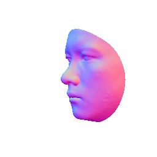
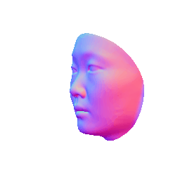
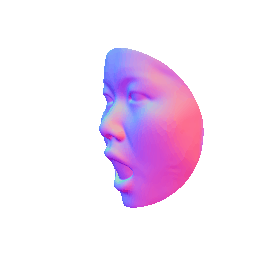
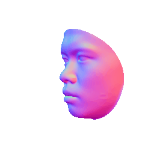
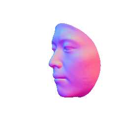

# ImFace++: A Sophisticated Nonlinear 3D Morphable Face Model with Implicit Neural Representations

###  [Paper](https://arxiv.org/abs/2312.04028)




Official code for ImFace++: A Sophisticated Nonlinear 3D Morphable Face Model with Implicit Neural Representations.

This paper presents a novel 3D morphable face model, named ImFace++, to learn a sophisticated and continuous space with implicit neural representations. ImFace++ first constructs two explicitly disentangled deformation fields to model complex shapes associated with identities and expressions, respectively, which simultaneously facilitate the automatic learning of correspondences across diverse facial shapes. To capture more sophisticated facial details, a refinement displacement field within the template space is further incorporated, enabling a fine-grained learning of individual-specific facial details.

## Trained model
| Trained Model            | Description  |
|-------------------|-------------------------------------------------------------|
| <a href="https://drive.google.com/drive/folders/1hibgi1MjQgLL3VXS7Y1F2Y9sTE4TzgjS?usp=sharing" target="_blank">ImFace++(translation)</a> | common translation deformation |


## Usage

### Generate face
For randomly generating face from ImFace++, run:
```
python scripts/random_generate.py --generate_type [test|train]
```
Please modify the `LOAD_PATH` in config file with your checkpoint's path and the `RESUME` to match the test dataset checkpoint. You can modify the `generate_type` to generate faces from test dataset or training dataset. Results can be found in `result/imface++/generate`.

### Fit with one 3D face
For fitting one sample, which is generated from FaceScape <a href="https://nbviewer.org/github/zhuhao-nju/facescape/blob/master/toolkit/demo_bilinear_basic.ipynb" target="_blank">toolkit</a>, run:
```
# preprocess demo data
python demo/process.py
# fit demo
python scripts/fit_one_sample.py
```
Please modify the `LOAD_PATH` in config file with your checkpoint's path. Results can be found in `result/imface++/fit/<timestamp>`.

### Related Projects

<a href="https://github.com/aejion/NeuFace" target="_blank">NeuFace: Realistic 3D Neural Face Rendering from Multi-view Images (CVPR 2023)</a>

<a href="https://arxiv.org/abs/2203.14510" target="_blank">ImFace: A Nonlinear 3D Morphable Face Model with Implicit Neural Representations （CVPR 2022）</a>


## Citation
If you find our work useful in your research, please consider citing:

	@inproceedings{zheng2022imface,
	  title={ImFace: A Nonlinear 3D Morphable Face Model with Implicit Neural Representations},
	  author={Zheng, Mingwu and Yang, Hongyu and Huang, Di and Chen, Liming},
	  booktitle={Proceedings of the IEEE/CVF Conference on Computer Vision and Pattern Recognition},
	  pages={20343--20352},
	  year={2022}
	}
	@inproceedings{zheng2023neuface,
	  title={NeuFace: Realistic 3D Neural Face Rendering from Multi-view Images},
	  author={Zheng, Mingwu and Zhang, Haiyu and Yang, Hongyu and Huang, Di},
	  booktitle={Proceedings of the IEEE/CVF Conference on Computer Vision and Pattern Recognition},
	  pages={16868--16877},
	  year={2023}
	}
	 @article{zheng2023imface++,
	  title={ImFace++: A Sophisticated Nonlinear 3D Morphable Face Model with Implicit Neural Representations},
	  author={Zheng, Mingwu and Zhang, Haiyu and Yang, Hongyu and Chen, Liming and Huang, Di},
	  journal={arXiv preprint arXiv:2312.04028},
	  year={2023}
	}

